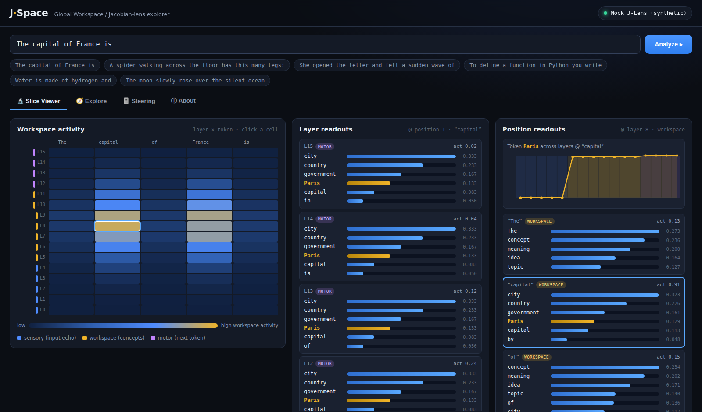

# J-Space — Workspace Explorer

A **mock, open-source interpretability explorer** for the *Global Workspace / Jacobian-lens*
view of language models. It recreates the exploration experience of the
[Transformer Circuits "Verbalizable Representations & the Global Workspace"](https://transformer-circuits.pub/2026/workspace/index.html)
slice viewer and [Neuronpedia](https://www.neuronpedia.org/)'s feature dashboards. It runs
**fully offline with zero dependencies** — pure Python standard library, no downloads, no
`torch`, no `transformers`, no HuggingFace access.

> ⚠️ The default backend is **synthetic**. Readouts are illustrative of the *structure* of a
> global workspace, not real model internals. It's a teaching / prototyping tool.



## The idea

The **Jacobian lens (J-lens)** reads out which vocabulary tokens a model is "poised to
verbalise" at each layer and token position — a proxy for its internal, reportable
**workspace**. Following the paper, the mock encodes three depth regions:

| Region | Layers | What the readout surfaces |
|---|---|---|
| 🟦 **sensory** | early | the input token itself + orthographic sub-pieces |
| 🟨 **workspace** | middle | semantically *related concepts* — where "verbalizable thought" lives, activity peaks |
| 🟪 **motor** | late | the likely *next token* / continuation |

## Features

- **Slice Viewer** — a layer × token **workspace-activity heatmap**; click any cell to see the
  vertical slice (readouts across all layers at a position), the horizontal slice (readouts
  across all positions at a layer), and a **token-trajectory chart** tracing one token's
  readout weight through the layers.
- **Explore** (Neuronpedia-style) — search concepts and activating contexts, then open a
  **feature dashboard** with the verbalizable direction's top tokens, an activation histogram,
  and top activating examples with per-token highlighting.
- **Steering** — amplify a concept direction and watch the continuation shift.

## Run it

```bash
# nothing to install — pure Python standard library, works offline
python3 server.py
# open http://localhost:8000
```

Options:

```bash
python3 server.py --port 9000          # choose a port
python3 server.py --layers 24          # simulate a deeper model
python3 server.py --model corpus       # learned n-gram backend (see below)
```

## Two offline backends

Both are pure stdlib and run with no network access — pick with `--model`:

| `--model` | What it is |
|---|---|
| `mock` *(default)* | **Synthetic.** Readouts come from a hand-curated concept graph — always meaningful, zero setup. |
| `corpus` | **Learned.** A tiny **n-gram language model trained at startup** from a bundled text corpus. Workspace readouts are the tokens most distributionally related to each token (ranked by pointwise mutual information); motor readouts are the model's learned next-token distribution. Real statistics, computed from data — no downloads. |

> ⚠️ Both backends are small and illustrative — they demonstrate the *structure* of a global
> workspace (sensory → workspace → motor), not the internals of a frontier model. It's a
> teaching / prototyping tool.

## Layout

```
server.py                 # zero-dependency stdlib HTTP server + JSON API
jlens/
  base.py                 # Backend interface + Analysis/Readout data shapes
  mock.py                 # deterministic synthetic J-lens (default backend)
  corpus.py               # tiny n-gram model learned from the bundled corpus
  knowledge.py            # concept graph, corpus, tokenizer utils
frontend/
  index.html  style.css  app.js    # self-contained vanilla-JS UI (no build step)
```

## API

| Method | Path | Body / query | Returns |
|---|---|---|---|
| `GET`  | `/api/config` | — | backend info, layer count, example prompts/features, steering concepts |
| `POST` | `/api/analyze` | `{prompt}` | full slice analysis: `tokens`, `activity[L][P]`, `readouts[L][P]`, `layer_regions` |
| `POST` | `/api/steer` | `{prompt, concept, strength}` | baseline vs. steered continuation |
| `GET`  | `/api/search` | `?q=` | matching concepts + activating corpus contexts |
| `GET`  | `/api/feature` | `?c=` | feature dashboard (top tokens, histogram, examples) |

## Credits / inspiration

- Anthropic Transformer Circuits — *Verbalizable Representations and the Global Workspace in
  Language Models*.
- Neuronpedia — feature dashboards, search, and steering UX.
